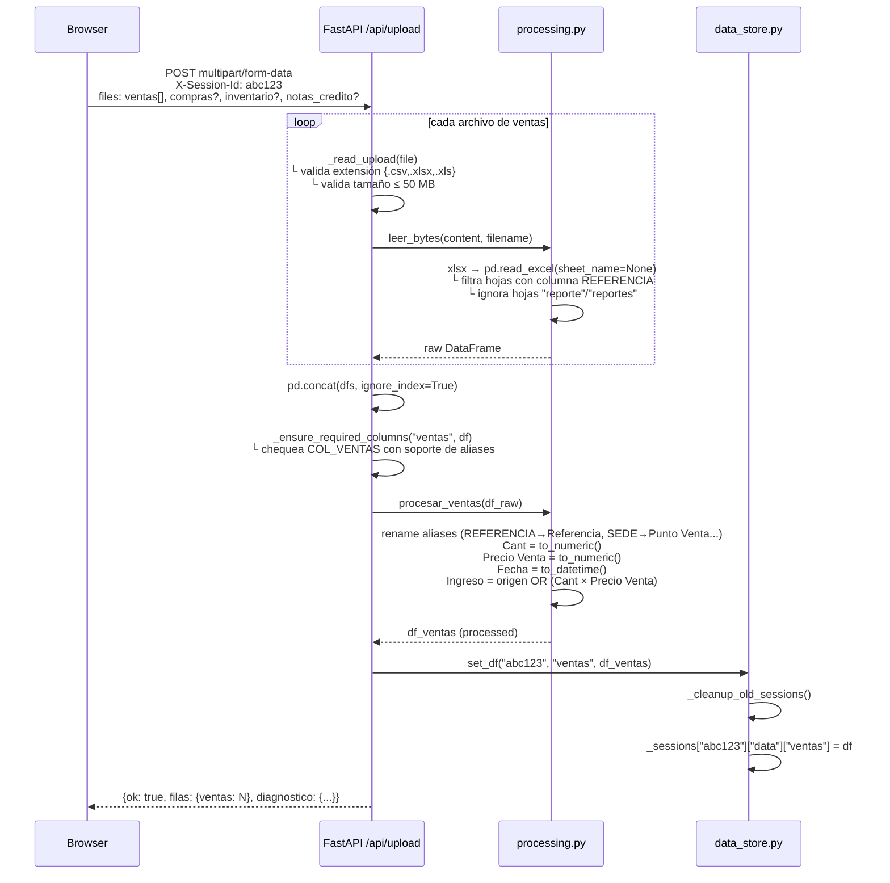
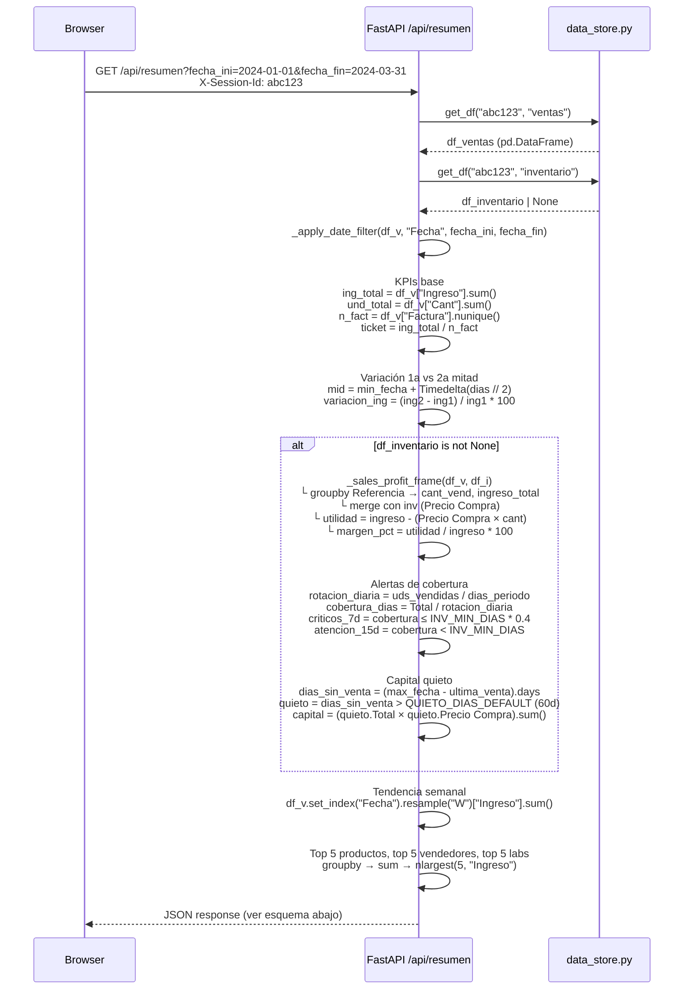
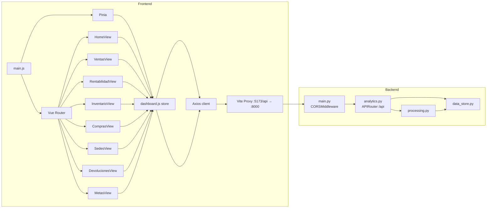

<p align="center">
  <h1 align="center">FarmAnalítics</h1>
  <p align="center">Analytics platform for pharmaceutical retail chains · FastAPI + Vue 3 · In-memory session architecture</p>
</p>

<p align="center">
  <a href="https://farm-analitics.vercel.app"></a>
  
  
  
  
</p>

---

## Architecture Overview

```
┌─────────────────────────────────────────────────────────────────────┐
│  BROWSER                                                            │
│                                                                     │
│  Vue 3 SPA (Vite)  ─── Pinia Store ─── Vue Router (8 routes)       │
│       │                    │                                        │
│   AppSidebar           dashboard.js                                 │
│  (file upload)        fetchResumen()                                │
│                       fetchVentas()  ...                            │
└────────────────────────────┬────────────────────────────────────────┘
                             │  HTTPS · multipart/form-data · JSON
                             │  Header: X-Session-Id: <uuid-v4>
                             │
┌────────────────────────────▼────────────────────────────────────────┐
│  FASTAPI  (Uvicorn ASGI)                                            │
│                                                                     │
│  main.py                                                            │
│  ├── CORSMiddleware (origins: vercel.app, railway.app, :5173)       │
│  └── router  →  backend/routers/analytics.py  (/api/*)             │
│                      │                                              │
│            ┌─────────┴──────────┐                                  │
│            ▼                    ▼                                   │
│     services/processing.py   services/data_store.py                │
│     ┌──────────────────┐     ┌──────────────────────────┐          │
│     │ leer_bytes()     │     │ _sessions: dict           │          │
│     │ procesar_ventas()│     │  { session_id: {          │          │
│     │ procesar_compras()│    │    data: {                │          │
│     │ procesar_inv()   │     │      ventas:    DataFrame │          │
│     │ procesar_nc()    │     │      compras:   DataFrame │          │
│     └──────────────────┘     │      inventario:DataFrame │          │
│                              │      notas_credito: DF    │          │
│                              │    },                     │          │
│                              │    last_accessed: float   │          │
│                              │  }                        │          │
│                              │  TTL: 24h · auto-cleanup  │          │
│                              └──────────────────────────┘          │
└─────────────────────────────────────────────────────────────────────┘
```

---

## Data Flow

### Upload Pipeline



### Query Pipeline — `/api/resumen`



### Session Lifecycle

```mermaid
flowchart TD
    A([Browser abre la app]) --> B{localStorage\nsession_id?}
    B -- No --> C[genera uuid-v4\nguarda en localStorage]
    B -- Sí --> D[reutiliza session_id existente]
    C --> E
    D --> E[Header X-Session-Id en cada request]

    E --> F[FastAPI recibe request]
    F --> G[_init_session → crea slot en _sessions]
    F --> H[_cleanup_old_sessions]

    H --> I{now - last_accessed\n> 24h?}
    I -- Sí --> J[del _sessions\[sid\]]
    I -- No --> K[mantiene datos]

    G --> L[procesa request\nlee/escribe DataFrames]
    L --> M[actualiza last_accessed = time.time\(\)]
    M --> N([devuelve JSON])

    style J fill:#ef4444,color:#fff
    style C fill:#3b82f6,color:#fff
    style N fill:#22c55e,color:#fff
```

---

## Module Map



---

## API Reference

Todos los endpoints bajo prefijo `/api`. Autenticación de sesión por header `X-Session-Id` (default: `"default-session"`).

### POST `/api/upload`

Acepta archivos como `multipart/form-data`. Cada campo puede ser uno o varios archivos.

| Campo | Tipo | Descripción |
| :--- | :--- | :--- |
| `ventas` | `UploadFile \| list[UploadFile]` | Archivos de ventas (uno o más) |
| `compras` | `UploadFile \| list[UploadFile]` | Archivos de compras |
| `inventario` | `UploadFile` | Inventario maestro (uno solo) |
| `notas_credito` | `UploadFile` | Notas de crédito / devoluciones |

```bash
curl -X POST https://farmanalitics-production.up.railway.app/api/upload \
  -H "X-Session-Id: mi-sesion-123" \
  -F "ventas=@ventas_enero.xlsx" \
  -F "ventas=@ventas_febrero.xlsx" \
  -F "inventario=@inventario_maestro.csv"
```

```json
// 200 OK
{
  "ok": true,
  "filas": { "ventas": 45230, "inventario": 3841 },
  "diagnostico": {
    "ventas": {
      "tipo": "ventas",
      "filas": 45230,
      "columnas": ["Referencia", "Descripcion", "Cant", "Precio Venta", "Fecha", "Punto Venta", "Laboratorio"],
      "requeridas": ["Referencia", "Descripcion", "Cant", "Precio Venta", "Laboratorio", "Fecha", "Punto Venta"],
      "faltantes": [],
      "ok": true
    }
  }
}
```

**Errores posibles:**

| HTTP | Causa |
| :--- | :--- |
| `400` | Extensión no permitida · Archivo vacío · Columnas requeridas faltantes |
| `413` | Archivo supera 50 MB |

---

### GET `/api/resumen`

**Parámetros:** `fecha_ini` (YYYY-MM-DD), `fecha_fin` (YYYY-MM-DD)  
**Requiere:** `ventas` cargado. `inventario` opcional — activa alertas y margen.

```json
{
  "periodo": { "inicio": "2024-01-01", "fin": "2024-03-31", "dias": 91 },
  "kpis": {
    "ingresos": 284750000,
    "unidades": 38241,
    "facturas": 9103,
    "ticket": 31281,
    "utilidad": 71187500,
    "margen_pct": 25.0,
    "variacion_ing": 4.2,
    "variacion_und": 2.8,
    "variacion_ticket": 1.3
  },
  "alertas": {
    "sin_stock": 12,
    "criticos_7d": 34,
    "atencion_15d": 87,
    "capital_quieto": 48230000
  },
  "devoluciones": {
    "total_devuelto": 3241000,
    "n_notas": 142,
    "tasa_pct": 1.14,
    "ingresos_netos": 281509000
  },
  "tendencia": [
    { "fecha": "2024-01-07", "ingreso": 9823000 }
  ],
  "sedes": [
    { "sede": "PRINCIPAL", "ingresos": 141200000, "unidades": 18940, "pct": 49.6 }
  ],
  "top_productos": [
    { "nombre": "METFORMINA 850MG X 30", "ingreso": 4120000, "pct": 100 }
  ],
  "top_vendedores": [...],
  "top_laboratorios": [...]
}
```

---

### GET `/api/ventas`

| Parámetro | Default | Descripción |
| :--- | :--- | :--- |
| `sede` | `"Todas"` | Filtra por `Punto Venta` |
| `nivel` | `"Todos"` | Filtra por columna `Nivel` si existe |
| `laboratorio` | `"Todos"` | Filtra por `Laboratorio` |
| `fecha_ini` | — | Inicio del rango (inclusive) |
| `fecha_fin` | — | Fin del rango (inclusive) |

---

### GET `/api/metas`

| Parámetro | Valores | Default |
| :--- | :--- | :--- |
| `agresividad` | `conservador` · `normal` · `agresivo` | `normal` |
| `fecha_ini` | YYYY-MM-DD | — |
| `fecha_fin` | YYYY-MM-DD | — |

**Algoritmo de proyección:**

```python
# Por cada sede
ventas_mes_anterior     = df_base["Ingreso"].sum()
idp_sede                = ventas_mes_anterior / dias_mes_anterior
proyeccion_base         = idp_sede * dias_totales_proy

incremento_hist         = (venta_hist_obj / venta_hist_prev) - 1.0
incremento_hist         = max(min(incremento_hist, 0.35), -0.20)  # clamp
incremento_aplicado     = incremento_hist + (factor_crecimiento - 1.0)

meta_sede               = max(proyeccion_base * (1.0 + incremento_aplicado), 0.0)
```

Donde `factor_crecimiento` es `1.02` / `1.05` / `1.10` según agresividad.

---

### Endpoints restantes

| Método | Endpoint | Requiere | Descripción |
| :--- | :--- | :--- | :--- |
| `GET` | `/api/rentabilidad` | ventas + inventario | Margen y utilidad por producto |
| `GET` | `/api/inventario` | inventario (ventas opcional) | Alertas de cobertura y stock quieto |
| `GET` | `/api/compras` | compras | Análisis por proveedor y sede |
| `GET` | `/api/sedes` | ventas | Comparativa entre puntos de venta |
| `GET` | `/api/notas-credito` | notas_credito | Devoluciones con motivos clasificados |
| `GET` | `/api/status` | — | Estado de la sesión |
| `GET` | `/api/schema` | — | Columnas requeridas y umbrales |
| `DELETE` | `/api/reset` | — | Limpia todos los datos de la sesión |

Swagger UI completo: `/docs`

---

## Data Contracts

### Esquema de columnas por tipo de archivo

```
ventas:
  required: [Referencia, Descripcion, Cant, Precio Venta, Laboratorio, Fecha, Punto Venta]
  aliases:  {REFERENCIA→Referencia, DESCRIPCION→Descripcion, CANT→Cant,
             Precio|PRECIO→Precio Venta, LABORATORIO→Laboratorio,
             FECHA→Fecha, SEDE→Punto Venta, FACTURA→Factura, NIVEL→Nivel}
  computed: Ingreso = Ingreso_origen ?? (Cant × Precio Venta)

compras:
  required: [FECHA, PROVEEDOR, REFERENCIA, DESCRIPCION, LABORATORIO, PRECIO, CANT, SEDE]
  computed: Costo Total = CANT × PRECIO

inventario:
  required: [Referencia, Descripcion, Laboratorio]
  optional: [Precio Compra, Precio Venta, Total, Stock Minimo, Stock Maximo, Nivel]
  computed: Total = sum(columnas numéricas excluidas de EXCLUDED_INVENTORY_COLUMNS)
            si la columna Total no existe

notas_credito:
  required: [Fecha, NotaCredito, PuntoVenta, Total]
  optional: [IVA, SubTotal, Saldo, Factura, Creada, Observaciones]
  computed: Total Neto = Total − IVA
            Motivo = classify(Observaciones)  # NLP por reglas
            PuntoVenta → rename → Punto Venta
```

### Clasificador de motivos de devolución

```python
_MOTIVO_RULES = [
    ("Error de Facturación",  ["error de facturaci", "error factur"]),
    ("Error del Vendedor",    ["error del vendedor", "error vendedor"]),
    ("Solicitud del Cliente", ["error del cliente", "cliente pide", "cliente no",
                               "cliente realiza", "cliente hizo", "cliente quiere"]),
    ("Cambio de Producto",    ["cambio", "cambi"]),
    ("Problema de Entrega",   ["domicilio", "entrega", "demora"]),
]
# Fallback: "Otro" | "Sin observación" si obs está vacío
```

### Health Score — fórmula completa

```python
score = 100
score -= min(alertas.sin_stock,   20) * 2.0   # max penalidad: -40 (quiebres de stock)
score -= min(alertas.criticos_7d, 10) * 1.5   # max penalidad: -15 (cobertura crítica)
if kpis.variacion_ing  < 0: score -= 10        # tendencia negativa de ingresos
if kpis.margen_pct     < 10: score -= 10       # margen bruto bajo
score = max(0, min(100, round(score)))
```

---

## Configuration Reference

`config.py` — fuente única de verdad para parámetros de negocio.

| Constante | Tipo | Valor | Descripción |
| :--- | :--- | :--- | :--- |
| `MAX_UPLOAD_SIZE` | `int` | `52_428_800` | Límite por archivo en bytes (50 MB) |
| `ALLOWED_EXTENSIONS` | `set` | `{".csv", ".xlsx", ".xls"}` | Formatos permitidos |
| `INV_MIN_DIAS` | `int` | `25` | Cobertura mínima de inventario (días) |
| `INV_MAX_DIAS` | `int` | `40` | Cobertura objetivo de inventario (días) |
| `LOW_MARGIN_PCT` | `float` | `5.0` | Umbral de margen bajo (%) |
| `HIGH_ROTATION_QUANTILE` | `float` | `0.80` | Percentil para clasificar alta rotación |
| `HIGH_ROTATION_MIN_UNITS` | `int` | `5` | Mínimo de unidades para alta rotación |
| `QUIETO_DIAS_DEFAULT` | `int` | `60` | Días sin movimiento → inventario quieto |
| `SEDES_INVENTARIO` | `list` | `[PRINCIPAL, SUCURSAL, MORATO, VARDI, CEDI, OFICINA 805]` | Sedes reconocidas |

---

## Project Structure

```
.
├── config.py                          # Global constants & business parameters
├── requirements.txt
├── Procfile                           # Railway: uvicorn backend.main:app
├── .python-version                    # 3.11.8
│
├── backend/
│   ├── main.py                        # FastAPI app, CORS middleware, router include
│   ├── routers/
│   │   └── analytics.py              # All endpoints (~1300 LOC)
│   │       ├── Helpers:  _safe(), _df_to_records(), _inclusive_days()
│   │       ├── Helpers:  _apply_date_filter(), _inventory_with_total()
│   │       ├── Helpers:  _sales_profit_frame(), _high_rotation_threshold()
│   │       ├── Helpers:  _column_diagnostic(), _ensure_required_columns()
│   │       └── Endpoints: upload, status, schema, reset, resumen, ventas,
│   │                       rentabilidad, inventario, compras, sedes,
│   │                       notas-credito, metas
│   └── services/
│       ├── processing.py              # ETL: parse, normalize, derive columns
│       │   ├── procesar_ventas()
│       │   ├── procesar_compras()
│       │   ├── procesar_inventario()
│       │   ├── procesar_notas_credito()
│       │   ├── _categorizar_motivo()  # NLP rule-based classifier
│       │   └── leer_bytes()           # xlsx multi-sheet parser
│       └── data_store.py              # In-memory session store
│           ├── _sessions: dict        # Global state
│           ├── set_df()
│           ├── get_df()
│           ├── get_status()
│           ├── clear_all()
│           └── get_default_ventas()   # Demo data loader (env var path)
│
├── frontend/
│   ├── vite.config.js                 # /api proxy → :8000
│   └── src/
│       ├── main.js                    # Bootstrap: createApp, Pinia, Router, ApexCharts
│       ├── App.vue                    # Root layout + AppSidebar
│       ├── style.css                  # CSS custom properties (design tokens)
│       ├── stores/
│       │   └── dashboard.js           # Pinia store (~400 LOC)
│       │       ├── state: { data, loading, status, sessionId }
│       │       ├── fetchResumen(), fetchVentas(), fetchRentabilidad()
│       │       ├── fetchInventario(), fetchCompras(), fetchSedes()
│       │       ├── fetchDevoluciones(), fetchMetas()
│       │       ├── uploadFiles(), resetSession()
│       │       └── fmt(), fmtN()      # Number formatters
│       ├── views/
│       │   ├── HomeView.vue           # Centro de Comando
│       │   ├── VentasView.vue
│       │   ├── RentabilidadView.vue
│       │   ├── InventarioView.vue
│       │   ├── ComprasView.vue
│       │   ├── SedesView.vue
│       │   ├── DevolucionesView.vue
│       │   └── MetasView.vue
│       └── components/
│           ├── AppSidebar.vue         # File upload + navigation
│           ├── charts/                # ApexCharts wrappers
│           └── ui/                    # SectionTitle, etc.
│
└── tabs/                              # Streamlit legacy modules (no new features)
    ├── tab_resumen.py
    ├── tab_ventas.py
    ├── tab_rentabilidad.py
    ├── tab_inventario.py
    ├── tab_compras.py
    └── tab_sedes.py
```

---

## Local Setup

**Requirements:** Python 3.11+ · Node.js 18+

```bash
# Backend
python -m venv .venv && .venv\Scripts\activate
pip install -r requirements.txt
uvicorn backend.main:app --reload --port 8000

# Frontend (new terminal)
cd frontend && npm install && npm run dev
```

- API: http://localhost:8000 · Swagger: http://localhost:8000/docs
- App: http://localhost:5173

Vite proxy forwards `/api/*` → `:8000` automatically. No extra config needed.

---

## Deployment

### Railway (backend)

```bash
# Procfile
web: uvicorn backend.main:app --host 0.0.0.0 --port ${PORT:-8000}
```

| Env var | Required | Description |
| :--- | :--- | :--- |
| `PORT` | Auto (Railway) | Injected by Railway |
| `DEFAULT_VENTAS_2025_PATH` | No | Path to a pre-loaded CSV for demo mode |

### Vercel (frontend)

| Setting | Value |
| :--- | :--- |
| Framework | Vite |
| Root directory | `frontend` |
| Build command | `npm run build` |
| Output directory | `dist` |
| `VITE_API_URL` | `https://<backend>.up.railway.app` |

CORS origins configured in `backend/main.py`:
```python
allow_origins = [
    "https://farm-analitics.vercel.app",
    "https://farmanalitics-production.up.railway.app",
    "http://localhost:5173",
    "http://localhost:3000",
    "http://127.0.0.1:5173",
]
```

---

## Notes

- `NaN`/`Inf` values from Pandas are serialized as `null` using `json.loads(df.to_json(orient="records"))` instead of `.to_dict()` to avoid JSON serialization errors.
- Excel files with multiple sheets are parsed by detecting sheets that contain a `REFERENCIA` column. Sheets named `"reporte"` or `"reportes"` are explicitly excluded to avoid mixing summary tabs with transactional data.
- The projection algorithm clamps historical growth to `[-20%, +35%]` to prevent distortion from atypical months.
- Vendors contributing less than 5% of a branch's revenue are excluded from the individual quota distribution in the metas endpoint.
- The `get_default_ventas()` function allows the metas endpoint to work without a user-uploaded file by falling back to a local CSV (useful for demo deployments).

---

## License

MIT
